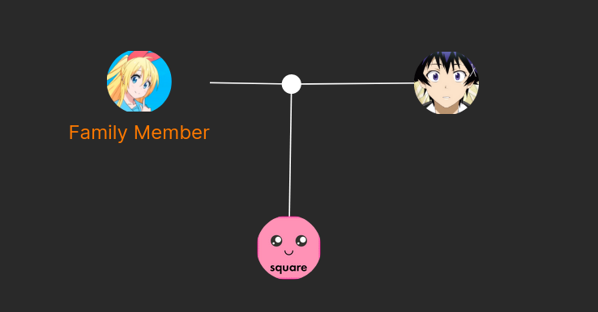

# Family Tree

<p align="center">

</p>

# About
This is family tree creation app with friendly user interface. It has user user authentication for secure storage of family data allowing user to create more than one family tree. 

Frontend: React, D3.js
Backend: .Net, PostgresQL

# Issues
Didn't finish dockerizing entire project, so runing app requires to run 2 seperate commands
## Runing backend
Backend is dockerized, so runing it requires one command in parent directory
```bash
docker-compose up
```

## Runing frontend
in frontend folder you need to run
```bash
npm i
npm run dev
```

